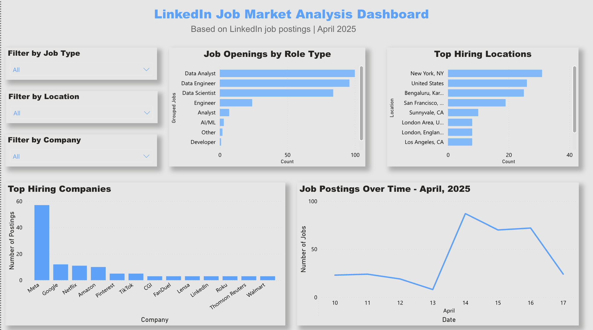
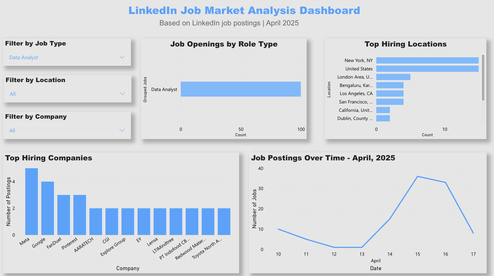
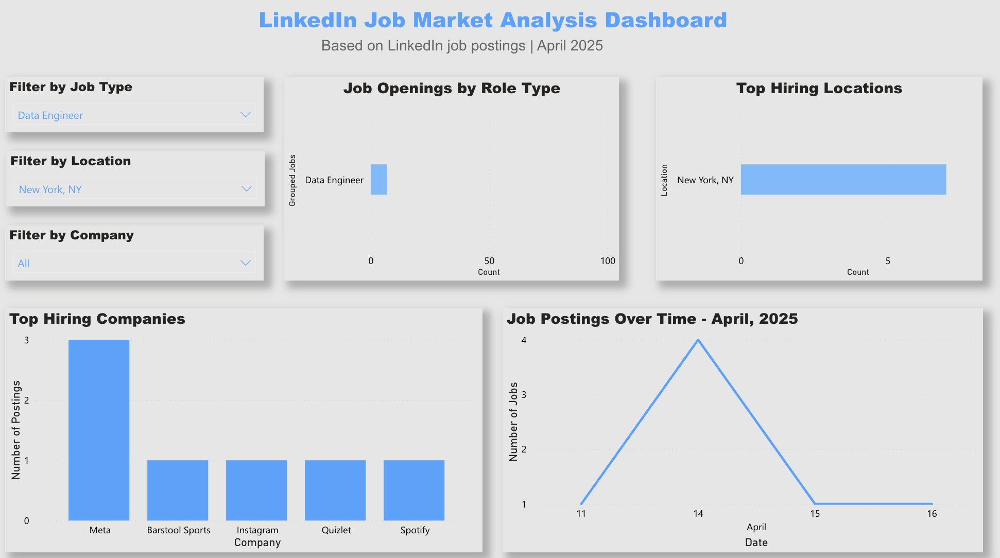

# 📊 LinkedIn Job Market Dashboard

This project analyzes job postings from LinkedIn to reveal hiring trends by role, location, and company.

## 🔍 Key Features
- 📈 Role demand by category (Data Analyst, Engineer, etc.)
- 🗺 Top cities hiring tech professionals
- 🏢 Top companies by job postings
- 📆 Job posting trends over time
- 🎛 Interactive filters by city, role, and company

## 📷 Dashboard Preview

**Full View:**

**Filtered Example – Data Analyst Role:**

**Filtered Example – Data Engineer Role & New York, NY:**

## 📁 Files Included
- `linkedin_jobs_cleaned.xlsx`: Cleaned dataset
- `DashboardScreenshot#1.png`: Final dashboard image

## 🧠 Summary of Insights
- Meta is the top hiring company, with over 50 postings
- Data Analysts, Engineers, and Scientists are the most in-demand roles
- New York and San Francisco lead in hiring activity
- A significant spike in job postings occurred around April 14, 2025

## 🔗 Tools Used
- Power BI (Web)
- Excel
- GitHub

